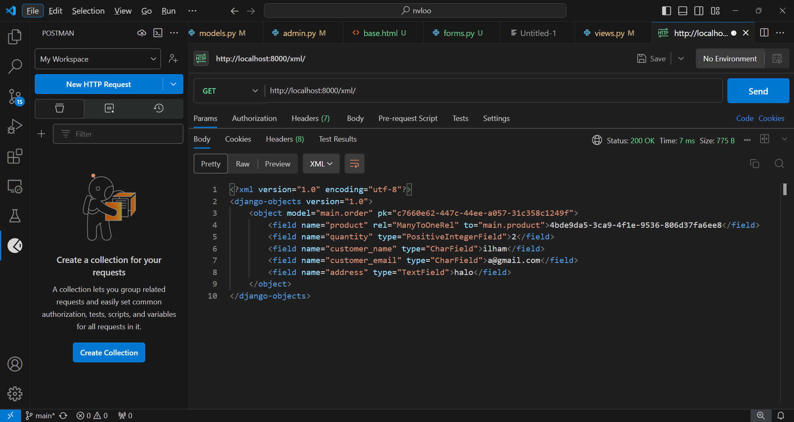
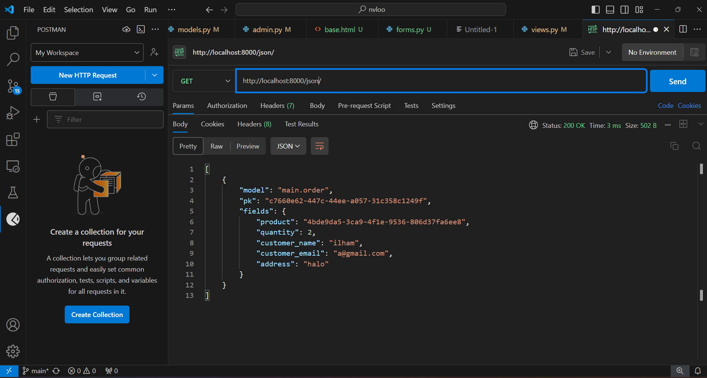
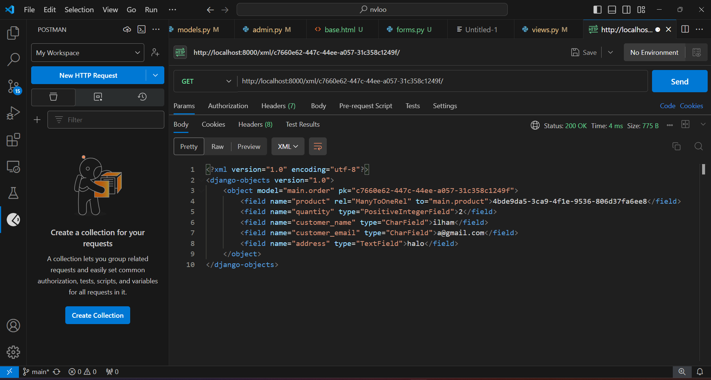
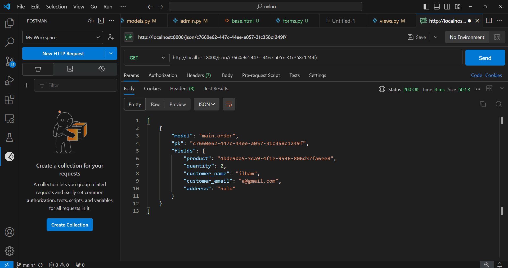
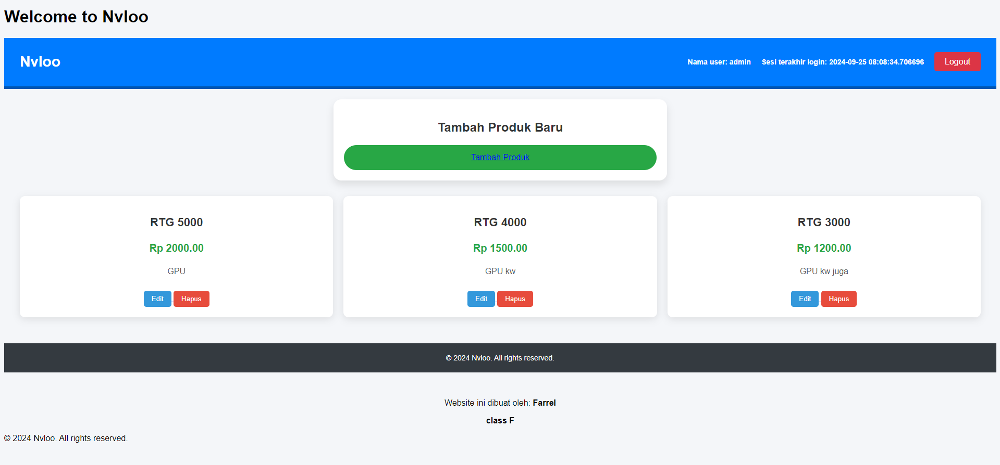

http://pbp.cs.ui.ac.id/sean.farrel/nvloo

Tugas 2

1. Jelaskan bagaimana cara kamu mengimplementasikan checklist di atas secara step-by-step (bukan hanya sekadar mengikuti tutorial).
    a. Membuat Sebuah Proyek Django Baru
        Langkah:
        Install Django dengan perintah: pip install django.
        Buat proyek baru dengan perintah: django-admin startproject nama_proyek.
        Ini akan membuat direktori baru dengan struktur dasar Django, termasuk manage.py, settings.py, dan folder lainnya yang penting untuk pengaturan proyek.
    b. Membuat Aplikasi dengan Nama 'main'
        Langkah:
        Navigasi ke direktori proyek: cd nama_proyek.
        Buat aplikasi baru dengan perintah: python manage.py startapp main.
        Ini akan membuat folder main yang berisi file seperti models.py, views.py, dan urls.py.
    c. Melakukan Routing pada Proyek untuk Menjalankan Aplikasi 'main'
        Langkah:
        Di dalam nama_proyek/nama_proyek/settings.py, tambahkan 'main', ke dalam INSTALLED_APPS.
        Buat file urls.py di dalam folder aplikasi main (jika belum ada), dan tambahkan rute di dalamnya.
        Di dalam nama_proyek/nama_proyek/urls.py, impor include dari django.urls dan tambahkan path menuju main.urls seperti berikut:
        from django.urls import include, path

        urlpatterns = [
            path('', include('main.urls')),
        ]
    d. Membuat Model 'Product' dengan Atribut
        Langkah:
        Buka main/models.py dan buat model seperti berikut:
        from django.db import models

        class Product(models.Model):
            name = models.CharField(max_length=100)
            price = models.DecimalField(max_digits=10, decimal_places=2)
            description = models.TextField()
            
            def __str__(self):
                return self.name
        Setelah itu, jalankan perintah python manage.py makemigrations dan python manage.py migrate untuk membuat dan menjalankan migrasi.
    e. Membuat Fungsi pada views.py untuk Menampilkan Nama Aplikasi dan Nama/Kelas
        Langkah:
        Buka main/views.py dan buat fungsi untuk merender template HTML:
        from django.shortcuts import render

        def home(request):
            context = {
                'app_name': 'Main',
                'student_name': 'Nama Anda',
                'student_class': 'Kelas Anda'
            }
            return render(request, 'home.html', context)
    f. Routing pada urls.py untuk Mempetakan Fungsi pada views.py
        Langkah:
        Di dalam main/urls.py, tambahkan kode untuk memetakan fungsi:
        from django.urls import path
        from . import views

        urlpatterns = [
            path('', views.home, name='home'),
        ]
    g. Deployment ke PWS
        Langkah:
        Pertama, pastikan aplikasi sudah siap untuk deployment. Buat file Procfile dan tambahkan:
        web: gunicorn nama_proyek.wsgi
        Gunakan layanan seperti PythonAnywhere untuk melakukan deployment. Upload proyek ke platform dan konfigurasikan domain untuk bisa diakses publik.

2. Buatlah bagan yang berisi request client ke web aplikasi berbasis Django beserta responnya dan jelaskan pada bagan tersebut kaitan antara urls.py, views.py, models.py, dan berkas html.

Proses Request-Response pada Aplikasi Django
Request:
Client membuat request ke server dengan URL tertentu.
urls.py memetakan request tersebut ke fungsi yang ada di views.py.
views.py mengakses data dari models.py (jika diperlukan) dan mengirimkannya ke template HTML.
Template HTML mengembalikan halaman dengan data yang sudah diolah ke client sebagai response.
Kaitan:

urls.py: Menentukan rute URL untuk permintaan.
views.py: Menangani logika bisnis dan menentukan apa yang akan ditampilkan.
models.py: Berinteraksi dengan database untuk menyimpan atau mengambil data.
Template HTML: Menampilkan data yang sudah diolah ke pengguna.

3. Jelaskan fungsi git dalam pengembangan perangkat lunak!
Git digunakan untuk version control, membantu pengembang melacak perubahan kode, berkolaborasi dengan tim, mengelola versi proyek, dan memulihkan versi kode sebelumnya jika terjadi kesalahan.

4. Menurut Anda, dari semua framework yang ada, mengapa framework Django dijadikan permulaan pembelajaran pengembangan perangkat lunak?
Menurut saya berdasarkan tutorial - tutorial sebelumnya dan tugas - tugas yang ada, Django adalah framework yang lengkap (batteries-included), dengan dokumentasi yang baik, memudahkan pemula untuk memahami dasar-dasar pengembangan aplikasi web secara menyeluruh, termasuk routing, model, dan views.

5. Mengapa model pada Django disebut sebagai ORM?
ORM (Object-Relational Mapping) menghubungkan model dalam bentuk objek Python dengan database relasional seperti PostgreSQL atau MySQL, sehingga pengembang bisa bekerja dengan database tanpa menulis query SQL langsung, cukup dengan metode Python. Adanya hubungan - hubungan terkait objek yang satu dengan yang lain juga menjadikan alasan Django dijadikan permulaan pembelajaran seperti pada pertanyaan sebelumnya.

Tugas 3
1. Jelaskan mengapa kita memerlukan data delivery dalam pengimplementasian sebuah platform?
    Dalam sebuah platform, data delivery merujuk pada proses pengiriman dan penerimaan data antara komponen atau aplikasi yang berbeda. Data delivery penting karena platform biasanya tidak berdiri sendiri; mereka berinteraksi dengan aplikasi lain (misalnya, aplikasi mobile, web service, database, API). Tanpa data delivery yang baik, platform tidak akan bisa bertukar informasi secara efisien, yang pada akhirnya dapat mengakibatkan pengalaman pengguna yang buruk atau masalah teknis. Data delivery memastikan bahwa:
    a. Data dikirim dan diterima secara akurat dan aman.
    b. Platform sinkron dengan layanan eksternal yang terhubung.
    c. Pengalaman pengguna realtime dapat dicapai (misalnya, update langsung di aplikasi).

2. Menurutmu, mana yang lebih baik antara XML dan JSON? Mengapa JSON lebih populer dibandingkan XML?
    Menurut saya, XML lebih baik daripada JSON. Perbandingannya sebagai berikut:
        XML:
            - Struktur lebih kompleks dan mendukung penanda (markup) yang kaya.
            - Mendukung atribut dan namespace, sehingga sering digunakan dalam sistem enterprise yang butuh struktur hierarkis lebih ketat.
            - Lebih berat karena sintaksnya yang verbose.
        JSON:
            - Lebih ringan dan mudah dibaca oleh manusia maupun mesin.
            - Sering digunakan untuk API modern karena formatnya sederhana (hanya pasangan kunci-nilai).
            - Memiliki integrasi langsung dengan JavaScript, membuatnya lebih populer di web development.
    Mengapa JSON lebih populer dibandingkan XML?
        - Lebih ringkas dan mudah dikelola.
        - Lebih cepat diparsing oleh browser dan bahasa pemrograman modern.
        - Lebih kompatibel dengan layanan RESTful API yang kini banyak digunakan oleh platform web dan   mobile.
        - Menyediakan struktur yang cukup sederhana untuk kebanyakan kasus penggunaan web.

3. Jelaskan fungsi dari method is_valid() pada form Django dan mengapa kita membutuhkan method tersebut?
    Method is_valid() pada form Django digunakan untuk memvalidasi input yang dimasukkan ke dalam form. Jika form tersebut berisi data yang benar (sesuai dengan aturan validasi yang telah didefinisikan di model atau form), maka method ini akan mengembalikan True, dan data yang valid akan tersedia dalam cleaned_data. Jika ada data yang tidak valid, method ini akan mengembalikan False, dan Django akan otomatis mengisi form dengan pesan kesalahan yang sesuai.

    Terkait alasan mengapa membutuhkan method tersebut adalah untuk memastikan data yang di-submit pengguna sesuai dengan aturan yang kita buat (misalnya, format email yang benar, tidak ada field yang kosong).
    Mencegah injeksi data berbahaya atau input yang tidak sesuai dengan ekspektasi sistem.

4. Mengapa kita membutuhkan csrf_token saat membuat form di Django? Apa yang dapat terjadi jika kita tidak menambahkan csrf_token pada form Django? Bagaimana hal tersebut dapat dimanfaatkan oleh penyerang?
    CSRF (Cross-Site Request Forgery) adalah serangan di mana penyerang dapat membuat pengguna tanpa sadar mengirimkan request ke server yang tampaknya sah. Dengan menambahkan csrf_token pada form, Django membuat token unik yang disertakan di setiap form yang di-submit. Token ini divalidasi oleh server untuk memastikan bahwa request tersebut memang berasal dari pengguna yang sah, bukan dari penyerang.
    Ketika tidak menambahkan csrf_token pada form maka server tidak bisa memverifikasi asal request, sehingga menjadi lebih rentan terhadap serangan CSRF. Penyerang dapat:
    Mengambil alih sesi pengguna dan melakukan tindakan seperti mengirim data tanpa persetujuan.
    Memanfaatkan sesi pengguna untuk mengubah data atau menjalankan aksi yang tidak diinginkan.

5. Jelaskan bagaimana cara kamu mengimplementasikan checklist di atas secara step-by-step (bukan hanya sekadar mengikuti tutorial).
    a. Membuat Form dan Model:
    Membuat ProductOrderForm di forms.py dengan menambahkan field untuk email dan phone_number.
    Memastikan model Product di models.py menyimpan informasi produk, termasuk email dan phone_number jika diperlukan.

    b. Membuat Template Form:
    Membuat template order_form.html yang berisi form HTML untuk menerima input dari pengguna, seperti email, phone_number, dan informasi produk.
    Menggunakan {{ form.as_table }} untuk merender form di template.

    c. Mengatur View:
    Menambahkan fungsi order_gpu di views.py untuk menangani permintaan GET dan POST, serta memproses form jika valid.
    Form yang diisi pengguna akan disimpan jika valid.

    d. Routing URL:
    Menambahkan URL pattern di urls.py untuk menampilkan form pemesanan GPU, sehingga pengguna dapat mengakses halaman pemesanan melalui URL /order/.

    e. Testing:
    Menguji apakah form dapat menampilkan dan menerima input dari pengguna dengan benar serta menyimpan data ke dalam database jika diperlukan.

Tugas 4
1. Apa perbedaan antara HttpResponseRedirect() dan redirect()
HttpResponseRedirect():

Ini adalah kelas respons di Django yang digunakan untuk mengalihkan pengguna ke URL yang ditentukan. Ketika Anda menggunakan HttpResponseRedirect(), Anda harus memberikan URL lengkap sebagai argumennya.

Contoh penggunaannya:
from django.http import HttpResponseRedirect

def my_view(request):
    return HttpResponseRedirect('/some-url/')
redirect():

Ini adalah fungsi yang lebih tinggi dan lebih mudah digunakan. Fungsi ini dapat menerima argumen dalam beberapa bentuk: URL, nama view (name), atau model instance. Jika diberikan nama view, redirect() akan menangani URL reverse untuk Anda.

Contoh penggunaannya:
from django.shortcuts import redirect

def my_view(request):
    return redirect('some_view_name')  # Mengalihkan berdasarkan nama view

2. Jelaskan cara kerja penghubungan model Product dengan User!
Penghubungan model Product dengan User dilakukan dengan menggunakan ForeignKey. Berikut adalah langkah-langkah untuk menghubungkan model:

Mendefinisikan Model:

Tambahkan field ForeignKey pada model Product yang merujuk ke model User.
Contoh definisi model:
from django.db import models
from django.contrib.auth.models import User

class Product(models.Model):
    name = models.CharField(max_length=100)
    owner = models.ForeignKey(User, on_delete=models.CASCADE)  # Menghubungkan dengan User
    ...
Migrasi Database:

Jalankan perintah makemigrations dan migrate untuk menerapkan perubahan ke database.
Penggunaan di Views:

Ketika produk baru ditambahkan, pastikan untuk menyetel owner produk tersebut ke pengguna yang sedang login.
def add_product(request):
    if request.method == 'POST':
        product = Product(name=request.POST['name'], owner=request.user)
        product.save()

3. Apa perbedaan antara authentication dan authorization, apakah yang dilakukan saat pengguna login? Jelaskan bagaimana Django mengimplementasikan kedua konsep tersebut.
Authentication:
Proses untuk memverifikasi identitas pengguna. Ini biasanya dilakukan melalui login dengan username dan password.
Saat pengguna login, sistem memeriksa kredensial yang dimasukkan dan mengidentifikasi siapa pengguna tersebut.

Authorization:
Proses untuk menentukan apakah pengguna yang telah terautentikasi memiliki izin untuk melakukan tindakan tertentu atau mengakses sumber daya tertentu.
Setelah pengguna berhasil login, sistem akan memeriksa hak akses dan peran pengguna untuk menentukan apa yang dapat mereka lakukan.

Berikut adalah penjelasan mengenai pertanyaan-pertanyaan yang Anda ajukan:

1. Apa perbedaan antara HttpResponseRedirect() dan redirect()?
HttpResponseRedirect():

Ini adalah kelas respons di Django yang digunakan untuk mengalihkan pengguna ke URL yang ditentukan. Ketika Anda menggunakan HttpResponseRedirect(), Anda harus memberikan URL lengkap sebagai argumennya.
Contoh penggunaannya:
python
Copy code
from django.http import HttpResponseRedirect

def my_view(request):
    return HttpResponseRedirect('/some-url/')
redirect():

Ini adalah fungsi yang lebih tinggi dan lebih mudah digunakan. Fungsi ini dapat menerima argumen dalam beberapa bentuk: URL, nama view (name), atau model instance. Jika diberikan nama view, redirect() akan menangani URL reverse untuk Anda.
Contoh penggunaannya:
python
Copy code
from django.shortcuts import redirect

def my_view(request):
    return redirect('some_view_name')  # Mengalihkan berdasarkan nama view
2. Jelaskan cara kerja penghubungan model Product dengan User!
Penghubungan model Product dengan User dilakukan dengan menggunakan ForeignKey. Berikut adalah langkah-langkah untuk menghubungkan model:

Mendefinisikan Model:

Tambahkan field ForeignKey pada model Product yang merujuk ke model User.
Contoh definisi model:
python
Copy code
from django.db import models
from django.contrib.auth.models import User

class Product(models.Model):
    name = models.CharField(max_length=100)
    owner = models.ForeignKey(User, on_delete=models.CASCADE)  # Menghubungkan dengan User
    ...
Migrasi Database:

Jalankan perintah makemigrations dan migrate untuk menerapkan perubahan ke database.
Penggunaan di Views:

Ketika produk baru ditambahkan, pastikan untuk menyetel owner produk tersebut ke pengguna yang sedang login.
python
Copy code
def add_product(request):
    if request.method == 'POST':
        product = Product(name=request.POST['name'], owner=request.user)
        product.save()
3. Apa perbedaan antara authentication dan authorization?
Authentication:

Proses untuk memverifikasi identitas pengguna. Ini biasanya dilakukan melalui login dengan username dan password.
Saat pengguna login, sistem memeriksa kredensial yang dimasukkan dan mengidentifikasi siapa pengguna tersebut.
Authorization:

Proses untuk menentukan apakah pengguna yang telah terautentikasi memiliki izin untuk melakukan tindakan tertentu atau mengakses sumber daya tertentu.
Setelah pengguna berhasil login, sistem akan memeriksa hak akses dan peran pengguna untuk menentukan apa yang dapat mereka lakukan.

Implementasi di Django:
Django memiliki sistem authentication yang built-in untuk mengelola login/logout dan memverifikasi identitas pengguna, yang dalam kasus ini terdapat fungsi login dan logout yang termasuk dalam built in Django.
Untuk authorization, Django menggunakan sistem permission yang bisa dikonfigurasi pada model dan view yang identik, yang dalam kasus ini, setiap user hanya dapat melihat produk yang ditambahkannya masing - masing.

4. Bagaimana Django mengingat pengguna yang telah login? Jelaskan kegunaan lain dari cookies dan apakah semua cookies aman digunakan?
Django menggunakan sesi untuk mengingat pengguna yang telah login. Ketika pengguna login, Django membuat sesi untuk pengguna tersebut dan menyimpannya di database.

Cookies:
Django menggunakan cookie untuk menyimpan sesi ID. Cookie ini dikirim ke browser pengguna dan digunakan untuk mengidentifikasi sesi saat pengguna melakukan permintaan berikutnya.
Kegunaan lain dari cookies:
Cookies dapat digunakan untuk menyimpan preferensi pengguna, data pelacakan, dan informasi lainnya.
Tidak semua cookies aman. Cookies yang menyimpan informasi sensitif harus diatur dengan pengaturan keamanan yang tepat, seperti HttpOnly dan Secure.

5.Jelaskan bagaimana cara kamu mengimplementasikan checklist di atas secara step-by-step (bukan hanya sekadar mengikuti tutorial).

Implementasi Registrasi, Login, dan Logout:
Buat view untuk registrasi, login, dan logout. Gunakan form Django untuk menangani input pengguna.
Gunakan UserCreationForm untuk registrasi dan authenticate() serta login() untuk login.

Buat Dua Akun Pengguna:
Buat dua akun pengguna melalui admin panel Django atau menggunakan shell.
Buat dummy data untuk produk dengan menghubungkan setiap produk ke akun pengguna yang sesuai.

Hubungkan Model Product dengan User:
Tambahkan ForeignKey dari model Product ke model User seperti yang dijelaskan di atas.

Tampilkan Detail Informasi Pengguna yang Login:
Di template, gunakan  untuk menampilkan username pengguna dan informasi lain yang relevan.

Terapkan Cookies untuk Last Login:
Setel cookie di view saat pengguna login, dan ambil nilai cookie di halaman utama.

Menangani Error dan Pengujian:
Uji semua fungsi yang diimplementasikan, termasuk login, logout, dan pengelolaan produk untuk memastikan semuanya berfungsi dengan baik.

