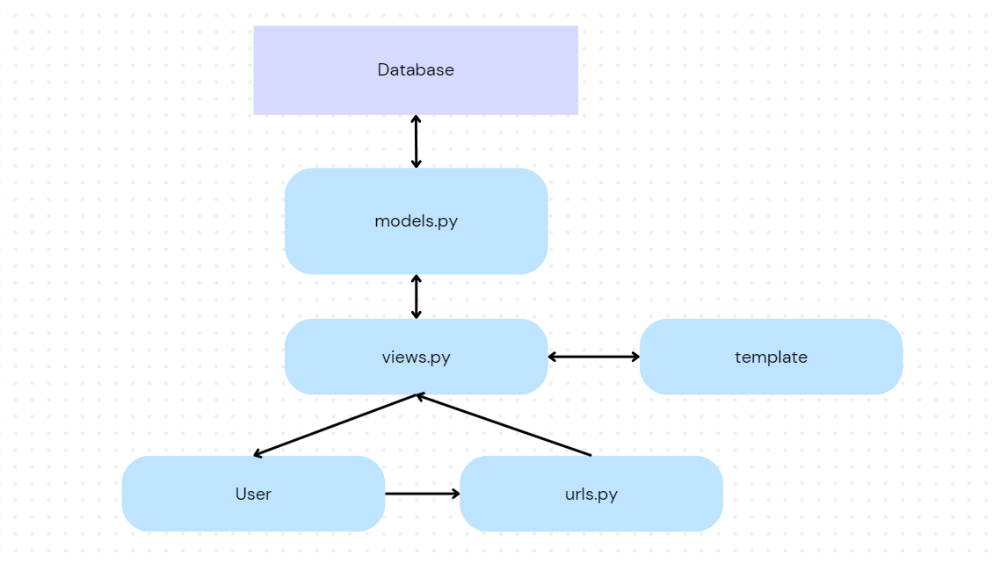

http://pbp.cs.ui.ac.id/sean.farrel/nvloo

Jelaskan bagaimana cara kamu mengimplementasikan checklist di atas secara step-by-step (bukan hanya sekadar mengikuti tutorial).
1. Membuat Sebuah Proyek Django Baru
Langkah:
Install Django dengan perintah: pip install django.
Buat proyek baru dengan perintah: django-admin startproject nama_proyek.
Ini akan membuat direktori baru dengan struktur dasar Django, termasuk manage.py, settings.py, dan folder lainnya yang penting untuk pengaturan proyek.
2. Membuat Aplikasi dengan Nama 'main'
Langkah:
Navigasi ke direktori proyek: cd nama_proyek.
Buat aplikasi baru dengan perintah: python manage.py startapp main.
Ini akan membuat folder main yang berisi file seperti models.py, views.py, dan urls.py.
3. Melakukan Routing pada Proyek untuk Menjalankan Aplikasi 'main'
Langkah:
Di dalam nama_proyek/nama_proyek/settings.py, tambahkan 'main', ke dalam INSTALLED_APPS.
Buat file urls.py di dalam folder aplikasi main (jika belum ada), dan tambahkan rute di dalamnya.
Di dalam nama_proyek/nama_proyek/urls.py, impor include dari django.urls dan tambahkan path menuju main.urls seperti berikut:
python
Copy code
from django.urls import include, path

urlpatterns = [
    path('', include('main.urls')),
]
4. Membuat Model 'Product' dengan Atribut
Langkah:
Buka main/models.py dan buat model seperti berikut:
python
Copy code
from django.db import models

class Product(models.Model):
    name = models.CharField(max_length=100)
    price = models.DecimalField(max_digits=10, decimal_places=2)
    description = models.TextField()
    
    def __str__(self):
        return self.name
Setelah itu, jalankan perintah python manage.py makemigrations dan python manage.py migrate untuk membuat dan menjalankan migrasi.
5. Membuat Fungsi pada views.py untuk Menampilkan Nama Aplikasi dan Nama/Kelas
Langkah:
Buka main/views.py dan buat fungsi untuk merender template HTML:
python
Copy code
from django.shortcuts import render

def home(request):
    context = {
        'app_name': 'Main',
        'student_name': 'Nama Anda',
        'student_class': 'Kelas Anda'
    }
    return render(request, 'home.html', context)
6. Routing pada urls.py untuk Mempetakan Fungsi pada views.py
Langkah:
Di dalam main/urls.py, tambahkan kode untuk memetakan fungsi:
python
Copy code
from django.urls import path
from . import views

urlpatterns = [
    path('', views.home, name='home'),
]
7. Deployment ke PWS
Langkah:
Pertama, pastikan aplikasi sudah siap untuk deployment. Buat file Procfile dan tambahkan:
makefile
Copy code
web: gunicorn nama_proyek.wsgi
Gunakan layanan seperti PythonAnywhere untuk melakukan deployment. Upload proyek ke platform dan konfigurasikan domain untuk bisa diakses publik.

Buatlah bagan yang berisi request client ke web aplikasi berbasis Django beserta responnya dan jelaskan pada bagan tersebut kaitan antara urls.py, views.py, models.py, dan berkas html.

Proses Request-Response pada Aplikasi Django
Request:
Client membuat request ke server dengan URL tertentu.
urls.py memetakan request tersebut ke fungsi yang ada di views.py.
views.py mengakses data dari models.py (jika diperlukan) dan mengirimkannya ke template HTML.
Template HTML mengembalikan halaman dengan data yang sudah diolah ke client sebagai response.
Kaitan:

urls.py: Menentukan rute URL untuk permintaan.
views.py: Menangani logika bisnis dan menentukan apa yang akan ditampilkan.
models.py: Berinteraksi dengan database untuk menyimpan atau mengambil data.
Template HTML: Menampilkan data yang sudah diolah ke pengguna.

Jelaskan fungsi git dalam pengembangan perangkat lunak!
Git digunakan untuk version control, membantu pengembang melacak perubahan kode, berkolaborasi dengan tim, mengelola versi proyek, dan memulihkan versi kode sebelumnya jika terjadi kesalahan.

Menurut Anda, dari semua framework yang ada, mengapa framework Django dijadikan permulaan pembelajaran pengembangan perangkat lunak?
Menurut saya berdasarkan tutorial - tutorial sebelumnya dan tugas - tugas yang ada, Django adalah framework yang lengkap (batteries-included), dengan dokumentasi yang baik, memudahkan pemula untuk memahami dasar-dasar pengembangan aplikasi web secara menyeluruh, termasuk routing, model, dan views.

Mengapa model pada Django disebut sebagai ORM?
ORM (Object-Relational Mapping) menghubungkan model dalam bentuk objek Python dengan database relasional seperti PostgreSQL atau MySQL, sehingga pengembang bisa bekerja dengan database tanpa menulis query SQL langsung, cukup dengan metode Python. Adanya hubungan - hubungan terkait objek yang satu dengan yang lain juga menjadikan alasan Django dijadikan permulaan pembelajaran seperti pada pertanyaan sebelumnya.